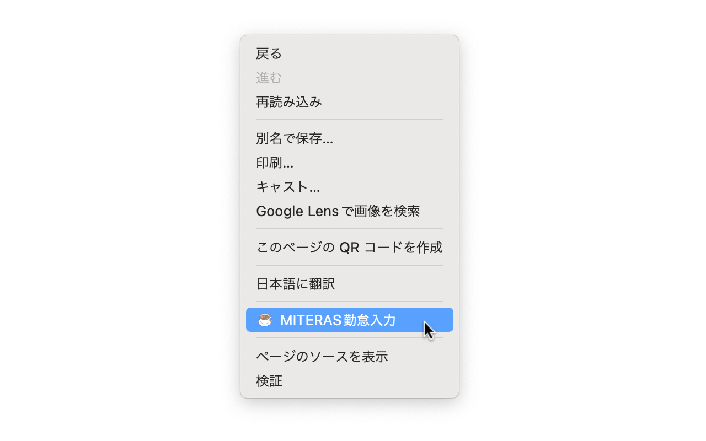

# 🚀 MITERAS勤怠入力

これは、MITERAS勤怠の休憩時間を自動的に入力するChrome拡張機能です。

## インストール方法

Chromeウェブストアからインストールできます。

## 使用方法

1. MITERAS勤怠上でコンテキストメニューを表示する。（通常は右クリック）
1. コンテキストメニューから「MITERAS勤怠入力」を選択する。
1. 休憩時間が自動的に入力されます。
